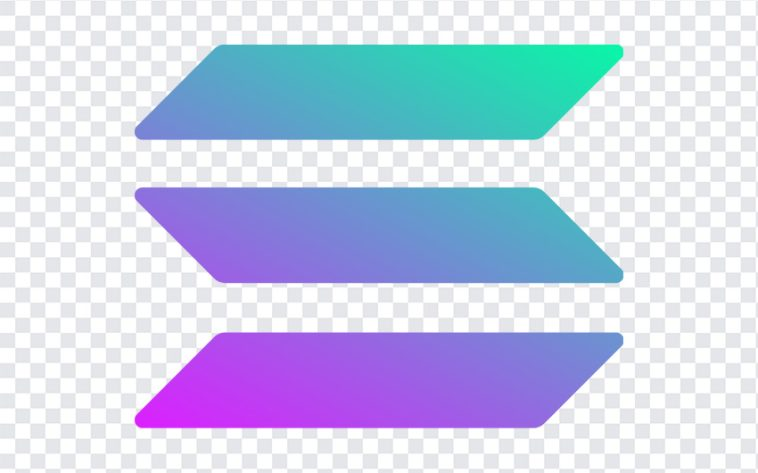

<p align="Center">
  
</p>

<h1 align="center"> NotesChain</h1>

**NotesChain** is a decentralized note-taking application (dApp) built on the **Solana** blockchain. It empowers users to own their data by removing centralized databases and traditional login systems, ensuring that every note is immutable, private, and permanently stored on-chain.

🚀 **Live Demo:** [noteschain.vercel.app](https://noteschain.vercel.app/)

---

## ✨ Features

* **Decentralized Storage:** Notes are stored as Program Derived Addresses (PDAs) on the Solana blockchain.
* **Wallet Authentication:** No passwords or emails. Connect your **Phantom** or any Solana-compatible wallet to manage your data.
* **Full CRUD Operations:**
    * **Create:** Generate new notes with titles and content.
    * **Read:** Fetch and display all notes associated with your specific public key.
    * **Update:** Edit existing notes directly on-chain.
    * **Delete:** Remove notes and reclaim rent from the Solana account.
* **Data Integrity:** Enforced constraints for titles (max 100 chars) and content (max 1000 chars) via the Anchor framework.

---

## 🛠️ Tech Stack

### Frontend
* **Framework:** Next.js 15 (App Router)
* **Styling:** Tailwind CSS
* **Animations:** Framer Motion
* **Wallet Integration:** `@solana/wallet-adapter-react`

### Blockchain / Backend
* **Language:** Rust (Anchor Framework)
* **Network:** Solana Devnet / Mainnet
* **Program ID:** `nJiToJCPGNjxQ3Q6ySWgLqEX1AybLhaJu6niQdBxosK`
* **Client Library:** `@project-serum/anchor`

---

## 🏗️ Architecture

The DApp interacts with a custom-deployed Solana program. Every note is its own account, derived using a seeds-based PDA (Program Derived Address) strategy.


### Data Structure (The Note Account)
```rust
struct Note {
    author: PublicKey,      // 32 bytes
    title: String,          // Variable
    content: String,        // Variable
    createdAt: i64,         // 8 bytes
    lastUpdated: i64,       // 8 bytes
}
```
# 🚀 Getting Started

Follow these steps to get a local copy of the project up and running.

### Prerequisites

* **Node.js** (v18+)
* **A Solana Wallet** (e.g., [Phantom](https://phantom.app/))
* **Devnet SOL** (Use the [Solana Faucet](https://faucet.solana.com/) to fund your wallet)

### 🛠️ Installation & Setup

1. **Install dependencies:**
   ```bash
   npm install

2. **Run the Development Server:**
    ```bash
    npm run dev

3. Access the application:
    Open http://localhost:3000 in your browser

## 🔒 Security & Constraints

To ensure data integrity and security on the blockchain, the following rules are enforced within the smart contract:

* **Unauthorized Access:** Only the author who created the note has the permission to update or delete it. Access control is verified on-chain via signer checks.
* **Input Validation:**
    * **Titles:** Must be between 1–100 characters.
    * **Content:** Must be between 1–1000 characters.


---

## 🤝 Contributing

Contributions are welcome! If you have suggestions for new features, bug fixes, or security enhancements, please follow these steps:

1.  **Fork** the Project.
2.  Create your **Feature Branch** (`git checkout -b feature/AmazingFeature`).
3.  Open an **Issue** or submit a **Pull Request**.

---

## 📄 License

This project is licensed under the **MIT License**.